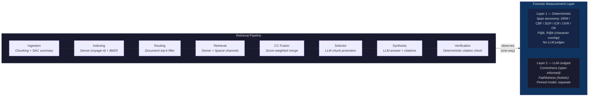

# Meridian

A forensic measurement framework for retrieval-augmented generation, validated on legal and medical IR benchmarks. The measurement layer — a deterministic, two-layer diagnostic that separates retrieval failures from reasoning failures — is the contribution. A 10-phase RAG pipeline is the proving ground.



**Key architectural constraint:** measurement observes the pipeline — the pipeline never bypasses measurement. Layer 1 (deterministic) and Layer 2 (LLM-judged) never contaminate each other. This separation is the point: when a number moves, you know whether the pipeline changed or the measurement changed.

---

## What this measures and why

Most RAG evaluation conflates retrieval quality with generation quality. A wrong answer could mean the retriever missed the evidence, or the model misread it. Meridian separates these:

**Layer 1 (deterministic, no LLM judges):** Every retrieved span is classified against ground-truth character offsets into six failure types — DRM (wrong document), CBF (chunk boundary), SGP (span gap), ICR (wrong section), OVR (over-retrieval), OK (correct). Pure arithmetic on character indices. When a number moves, you know whether the pipeline changed or the measurement changed.

**Layer 2 (LLM-judged, separate):** Answer correctness (does the answer convey the ground-truth information?) and faithfulness (is each claim entailed by the retrieved context?). Judged by a pinned model (DeepSeek-v4-flash, temperature 0) held constant across all comparisons.

The layers never contaminate each other. Layer 1 is the trust anchor; Layer 2 measures answer quality on top of that foundation.

**Scope:** Layer 1's span-forensic taxonomy requires character-span ground truth. It applies to benchmarks with span annotations (LegalBench-RAG) but not to document-level relevance benchmarks (most of BEIR). This is a scope boundary, not a limitation of the approach — it's what makes the taxonomy deterministic rather than model-dependent.

---

## Headline results

### Primary claim: controlled config-stack delta

On the combined-index benchmark regime (all 4 LegalBench-RAG corpora pooled into one 11,524-chunk index, 72 documents, 194 queries per corpus), the best configuration adds:

|  | Arm 0 (RRF baseline) | Arm 1 (best config) | Delta |
|--|---------------------|--------------------|----|
| **Correctness** | 60.5% | 68.3% | **+7.9pp** |
| **Faithfulness** | 91.7% | 95.9% | **+4.2pp** |

Both arms use the same index, same embedder (voyage-4), same judge. The delta isolates the contribution of CC fusion + document routing + unconditional selector over the RRF foundation.

**Best config:** SAC + CC fusion (per-corpus alpha, dense-heavy) + always-on hybrid document routing (top-3) + unconditional selector (wider-pool top-30, re-synth on promotion) + no reranker + single-shot.

### External comparison (system-vs-system, not method-alone)

Retrieval metrics on 3 un-confounded corpora (512-char chunks, comparable to the paper's 500-char RCTS). Published baselines from arXiv 2408.10343, Table 5 (RCTS, text-embedding-3-large, dense-only, no reranker). Measurement ruler calibrated within ~2-3pp embedding-drift floor on these corpora (Finding 44).

| Corpus | Meridian P@1 | RCTS P@1 | Meridian R@8 | RCTS R@8 |
|--------|-------------|----------|-------------|----------|
| ContractNLI | 0.422 | 0.066 | 0.810 | 0.250 |
| CUAD | 0.394 | 0.020 | 0.814 | 0.317 |
| PrivacyQA | 0.297 | 0.144 | 0.579 | 0.424 |

**Framing:** This compares the full Meridian stack (SAC + CC + hybrid dense/sparse + routing + selector, voyage-4) against a bare baseline (RCTS chunking, dense-only retrieval, text-embedding-3-large). The advantage bundles embedder quality + hybrid retrieval + fusion method + routing. It is a system-level comparison — not evidence that any single component is responsible for the multiplier.

MAUD's external comparison is set aside — its 2048-char chunks (4x the paper's 500-char) create a chunk-granularity confound that mechanically deflates character-overlap precision (Finding 46). ContractNLI is caveated (benchmark-file provenance differs from the paper's — Finding 44).

### NFCorpus transfer (retrieval stack only)

First non-legal test. NFCorpus (BEIR medical IR, 3,633 documents, 323 queries):

| System | nDCG@10 |
|--------|---------|
| Meridian (CC α=0.1, routing OFF) | 0.399 |
| BM25+cross-encoder reranker | 0.350 |
| BM25 | 0.325 |
| contriever | 0.328 |

Beats the classic BEIR baselines (original 2021 paper). These are dated single-method baselines — modern dense retrievers (2024+) score comparably. Frame as "above classic baselines," not "SOTA."

**What transferred:** the retrieval stack (hybrid dense+sparse, CC fusion). CC over RRF adds +5.6pp on NFCorpus, comparable to +7.9pp on legal — CC fusion is a domain-general improvement.

**What did not transfer / was not tested:** the span-forensic measurement framework (Layer 1 taxonomy). BEIR provides document-level relevance judgments, not character spans — Layer 1's taxonomy could not run. Routing was correctly self-disabled by the sweep (hurts on dispersed-relevance medical text — see Limitations). NFCorpus is a retrieval-transfer result, not a measurement-framework-transfer result.

**The genuine finding:** routing is a *concentrated-relevance* technique. It monotonically hurts on NFCorpus (OFF > k=10 > k=5 > k=3), because medical queries have many relevant documents and routing's hard-filter discards them. The sweep auto-detected this — consistent with the legal-domain finding that routing benefit tracks document-discrimination difficulty (Finding 23). Characterizing routing's boundary is the real result.

---

## The 10-phase pipeline

Phases 1-2 run once per corpus (indexing). Phases 3-10 run per query.

| Phase | What it does | Measurement verdict |
|-------|-------------|---------------------|
| 1. Chunking | Split documents | Fixed-stride (512-char for CNL/PQA/CUAD, 2048-char for MAUD). Section-aware and hierarchical alternatives both tested negative as general levers. |
| 2. Indexing | Embed and store | SAC (summary-augmented chunking) validated — bakes document identity into embeddings, reduces DRM. |
| 3. Query rewriting | Transform query pre-retrieval | **OFF.** Static rewrite is net-negative on synthesis quality (Finding 36). Raw query to retrieval. |
| 4. Retrieval | Dense (Voyage) + sparse (BM25) | Hybrid retrieval with document routing (top-3). Routing always-on for concentrated-relevance corpora, off for dispersed. |
| 5. Fusion | Combine dense + sparse | CC fusion over RRF. Dense-heavy alpha (0.1-0.2). Transfers to non-legal domain. |
| 6. Reranking | Cross-encoder re-scoring | **OFF.** Blind to document identity on homogeneous corpora — promotes wrong-document chunks at high confidence (~79% DRM). |
| 7. Context | Select chunks for LLM | Top-8 from fused results. Wider pool (top-30) feeds the selector. |
| 8. Synthesis | LLM generates answer | DeepSeek-v4-flash, structured claim-citation output. Pro tier tested indistinguishable within ±2-4pp variance (Finding 34). |
| 9. Verification | Deterministic citation check | ENTAILED / CONTRADICTED / BASELESS per claim. Conservative false-positive on legal negation (Finding 41). |
| 10. Agentic loop | Iterate retrieval | **Single-shot.** Loop mechanism was broken (Finding 35), fixed, retested — still no gain (Finding 37). Comprehension-bound, not access-bound. |

---

## Limitations

- **Routing degrades on topically-homogeneous cross-corpus retrieval.** ContractNLI routing drops to 76% recall in the combined-index regime — NDA documents confused with CUAD's commercial contracts. 47/194 queries get zero correct-document chunks. A genuine architectural limitation when document-level routing can't discriminate similar contract types.

- **Routing hurts on dispersed-relevance corpora.** NFCorpus confirmed: routing monotonically degrades when many documents are relevant per query. Routing is a concentrated-relevance technique, not universal.

- **Span-forensic framework requires character-span ground truth.** Layer 1's taxonomy (the core contribution) does not apply to document-level relevance benchmarks (most of BEIR, MS MARCO, etc.). This limits the framework's applicability to benchmarks with span annotations.

- **MAUD external comparison confounded** by 2048-char vs 500-char chunk granularity (Finding 46). Not reported as a multiplier.

- **ContractNLI external baseline caveated.** Benchmark-file provenance differs from the paper's generation pipeline (Finding 44). ContractNLI's published baseline range is uncertain.

- **Affirmative-only evaluation.** All four LegalBench-RAG corpora contain only queries with affirmative answers. Correctness measures recall of evidence that exists — not false-positive rate on evidence that doesn't.

- **Measurement-bug discipline.** Four silent bugs were caught during the headline measurement session before they could ship wrong numbers: a model-ID alias routing to the wrong tier (Finding 34), a BM25/dense channel mismatch on the combined index, a span-offset bug producing zero-overlap metrics, and an undocumented chunk-size inconsistency across corpora. Each was caught by verification checks, not by the numbers looking wrong — the project's thesis is that measurement rigor requires this kind of verify-before-trust discipline.

---

## Reproducing

### Infrastructure

- **Qdrant** — vector database (cloud or local)
- **Voyage AI** — embeddings (voyage-4)
- **DeepSeek** — LLM calls (deepseek-v4-flash for synthesis and judging)

```bash
cp .env.example .env
# Fill in: VOYAGE_API_KEY, DEEPSEEK_API_KEY, QDRANT_URL, QDRANT_API_KEY
```

### Run an evaluation

```bash
# Per-corpus eval (194 queries, best config)
python scripts/run_corpus_eval.py \
  --corpus contractnli \
  --chunk-alpha 0.2 \
  --routing-topk 3 \
  --routing-alpha 0.3 \
  --workers 12 \
  --output data/eval_contractnli.jsonl

# Combined-index headline (benchmark regime)
python scripts/run_headline_combined.py --workers 8

# NFCorpus transfer scout
python scripts/run_nfcorpus_scout.py

# Judges (Layer 2)
python scripts/judge_answers_v2.py --corpus contractnli --input data/eval_contractnli.jsonl
python scripts/judge_faithfulness.py --corpus contractnli --input data/eval_contractnli.jsonl

# Measurement-layer calibration (reproduces paper's baseline)
python scripts/run_calibration.py
```

### Key dependencies

Python 3.11+. Core: `qdrant-client`, `voyageai`, `openai`, `instructor`, `rank-bm25`, `pandas`, `numpy`, `beir`.

---

## Repository map

```
core/
  measurement/       Layer 1: taxonomy, metrics, span_overlap (deterministic, no LLM)
  retrieval/         Dense (Qdrant/Voyage), sparse (BM25), fusion (CC/RRF), routing
  supervisor/        Pipeline: phases 3-10, graph, state, context
  ingestion/         Chunking (fixed-stride, section-aware), embedding pipeline
  evaluation/        Ground-truth adapters (per-corpus), fingerprinting

scripts/
  run_corpus_eval.py           Per-corpus eval harness
  run_headline_combined.py     Combined-index headline (benchmark regime)
  run_headline.py              Per-corpus headline (3-arm: baseline/flash/Pro)
  run_nfcorpus_scout.py        NFCorpus transfer (BEIR, nDCG@10)
  run_calibration.py           Measurement-layer calibration vs paper
  judge_answers_v2.py          Layer 2: answer correctness
  judge_faithfulness.py        Layer 2: faithfulness (holistic/strict)

docs/
  DECISIONS.md       47 findings with corrections — the evidence trail
```
