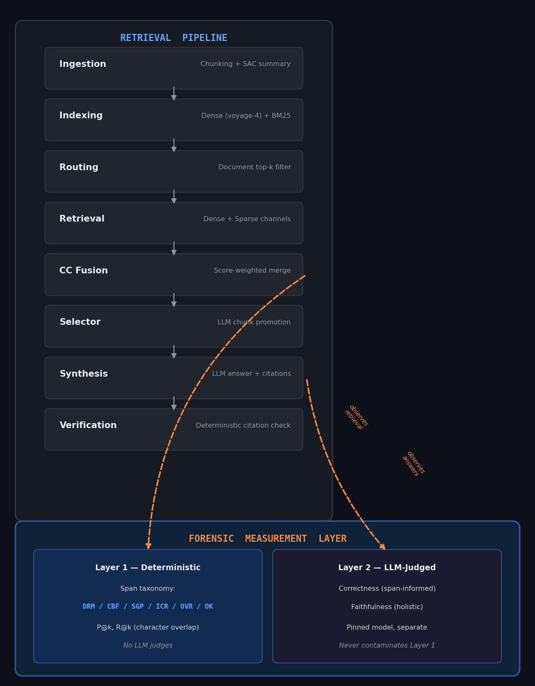
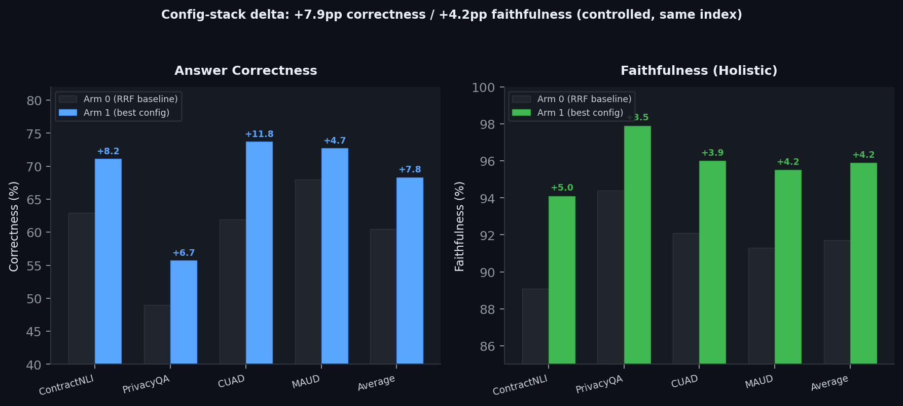
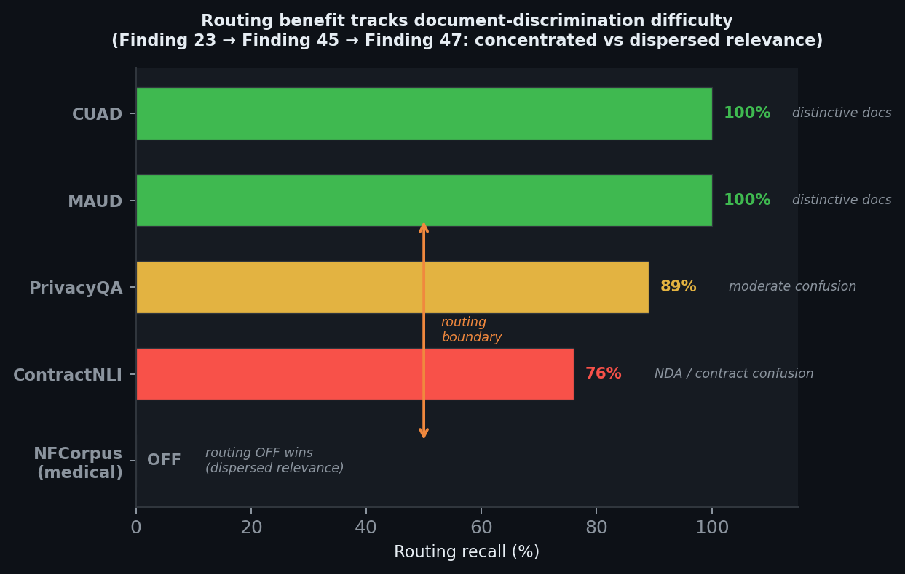

# Meridian

A forensic measurement framework for RAG systems — deterministic retrieval diagnostics that separate "the retriever missed" from "the model misread," validated on legal and medical benchmarks. The 10-phase agent is the proving ground; the measurement layer is the contribution.

**Four silent measurement bugs caught by the framework's own verify-before-trust discipline before they shipped wrong numbers. That's the proof it works — a ruler that checks itself.**

---

## Choose your depth

| Format | Time | What it is |
|---|---|---|
| **[Condensed Autopsy (PDF)](./Meridian_Autopsy.pdf)** | ~6 min | The 5-page record: thesis, the four caught bugs, headline numbers, architecture, limitations. Start here. |
| **[Full Report](./docs/REPORT.md)** | ~15 min | Complete methodology: all 10 phases evaluated, measurement layer design, end-to-end statistics, caveats. |
| **[47 Findings](./docs/DECISIONS.md)** | reference | The evidence trail — every A/B, correction, and preclusion. The raw record. |

---

## The headline

```
4 corpora × 194 queries × 2 arms on a combined 11,524-chunk index.
+7.9pp correctness / +4.2pp faithfulness (controlled config-stack delta).
Ruler calibrated against LegalBench-RAG (arXiv 2408.10343) on 3/4 corpora.
4 silent measurement bugs caught before shipping — the thesis in practice.
47 findings with 7 corrections — the evidence trail IS the methodology.
```

---

## Architecture



The pipeline spine runs top-to-bottom (ingestion through verification). The measurement layer observes at two points — Layer 1 scores the *retrieval output* (deterministic, no LLM), Layer 2 scores the *answer output* (LLM-judged, separate). The arrows are one-way: measurement observes the pipeline; the pipeline never bypasses measurement. This separation is the architecture's point — when a number moves, you know which side changed.

---

## The measurement layer

This is the contribution. Everything else supports it.

### Layer 1 — Deterministic retrieval taxonomy (no LLM judges)

Every retrieved span is classified against ground-truth character offsets into one of six failure types:

| Code | Failure type | What it tells you |
|------|-------------|-------------------|
| **DRM** | Document retrieval miss | Retrieved from the wrong document entirely |
| **CBF** | Chunk boundary failure | Right document, answer straddles a chunk split |
| **SGP** | Span gap | Right document, only part of a multi-span answer found |
| **ICR** | Incorrect region | Right document, wrong section |
| **OVR** | Over-retrieval | Right region, chunk much coarser than the evidence |
| **OK** | Correct | Retrieved span covers the ground-truth evidence |

Classification is pure arithmetic on character indices — no embeddings, no model calls, no judgment. Scoring is per-span (not merged-character-set) to correctly handle multi-span evidence (43% of LegalBench-RAG queries). P@k and R@k are character-overlap ratios computed from these spans.

**Why deterministic matters:** LLM judges drift with model updates, temperature, and prompt wording. A deterministic anchor eliminates that variable. When a number moves, you know whether the pipeline changed or the measurement changed — a capability LLM-only evaluation lacks.

### Layer 2 — LLM-judged answer quality (separate, clearly labeled)

Two metrics, both judged by a pinned model (DeepSeek-v4-flash, temperature 0, thinking disabled) held constant across all comparisons:

- **Correctness** — does the answer convey the same information as the ground-truth evidence? Span-informed: the judge sees both the system's answer and the golden evidence text.
- **Faithfulness** — is each answer claim entailed by the retrieved context? Holistic groundedness (RAGAS definition): each claim judged against the full retrieved context.

Layer 2 never contaminates Layer 1. They are reported separately and measure different things: Layer 1 measures retrieval, Layer 2 measures reasoning/generation.

### Ruler calibration

Before any external comparison, the measurement layer was empirically calibrated against the published LegalBench-RAG baseline (arXiv 2408.10343, Table 5). The paper's exact stack was replicated (RCTS 500-char, text-embedding-3-large, dense-only cosine, sqlite-vec) and run through our measurement layer. Three of four corpora reproduced within a ~2-3pp embedding-drift floor. The ruler computes correctly (Finding 44).

### The four caught bugs — the thesis in practice

The measurement framework's value is proven by what it caught:

1. **Pro model-ID alias** — `PRO_MODEL="deepseek-chat"` silently routed to flash, not Pro. Every prior "Pro" test was actually flash-vs-flash. Caught by billing check + served-model logging. (Finding 34)
2. **BM25 channel mismatch** — combined-index dense searched mini-doc chunks while BM25 searched the full 96K-chunk parquet. Two channels measuring different pools. Caught by crash on CUAD + post-mortem. (Finding 45)
3. **Zero-span offset bug** — Qdrant payloads don't store character spans; the combined-index builder defaulted to (0,0). All P@k/R@8 computed as ~0 — a plausible-looking near-zero, not an obvious crash. Caught by sanity-check against calibration. (Finding 45)
4. **Chunk-size inconsistency** — MAUD uses 2048-char chunks while the other three use 512-char. Previously undocumented. Confounds MAUD's external P@k comparison. Caught during external-baseline verification. (Finding 46)

Each was caught by systematic verification, not by the numbers looking wrong. A wrong number from a silent bug looks exactly like a correct number from a real measurement — the only defense is checking the instrument, not just the reading.

---

## Results

### Config-stack delta (controlled, same index both sides)



| Corpus | Correctness Arm 0 → Arm 1 | Faithfulness Arm 0 → Arm 1 |
|--------|---------------------------|----------------------------|
| ContractNLI | 62.9% → 71.1% (+8.2pp) | 89.1% → 94.1% (+5.0pp) |
| PrivacyQA | 49.0% → 55.7% (+6.7pp) | 94.4% → 97.9% (+3.5pp) |
| CUAD | 61.9% → 73.7% (+11.8pp) | 92.1% → 96.0% (+3.9pp) |
| MAUD | 68.0% → 72.7% (+4.7pp) | 91.3% → 95.5% (+4.2pp) |
| **Average** | **60.5% → 68.3% (+7.9pp)** | **91.7% → 95.9% (+4.2pp)** |

Both arms use the same combined index (11,524 chunks, 72 documents, 4 corpora pooled), same embedder, same judge. The delta isolates CC fusion + routing + selector over RRF.

### External comparison (system-vs-system)

| Corpus | Meridian P@1 | RCTS P@1 | Meridian R@8 | RCTS R@8 |
|--------|-------------|----------|-------------|----------|
| ContractNLI | 0.422 | 0.066 | 0.810 | 0.250 |
| CUAD | 0.394 | 0.020 | 0.814 | 0.317 |
| PrivacyQA | 0.297 | 0.144 | 0.579 | 0.424 |

Published baselines from arXiv 2408.10343 Table 5 (RCTS, text-embedding-3-large, dense-only). This compares the full Meridian stack against a bare baseline — the advantage bundles embedder + hybrid retrieval + fusion + routing. It is system-level evidence, not a single-component ablation. MAUD excluded (chunk-granularity confound). ContractNLI caveated (benchmark-file provenance).

### Routing boundary



Routing is a concentrated-relevance technique, not universal. It holds at 100% on distinctive corpora (CUAD, MAUD), degrades to 76% on homogeneous cross-corpus retrieval (ContractNLI NDAs confused with CUAD contracts), and is correctly self-disabled on dispersed-relevance medical text (NFCorpus). The sweep auto-detects when routing helps — consistent across Findings 23, 45, and 47.

### NFCorpus transfer (retrieval stack only)

nDCG@10 = 0.399, above the classic BEIR baselines (BM25 0.325, BM25+CE 0.350, contriever 0.328). CC fusion transfers as a general improvement (+5.6pp over RRF). The span-forensic measurement framework was not exercised — BEIR provides document-level relevance, not character spans. This is a retrieval-transfer result; the routing-boundary characterization is the real finding.

---

## What Meridian is not

- **Not an autonomous research agent.** That direction was explored in v1 and deliberately abandoned. Phase 10's loop is per-query only.
- **Not a SOTA-everywhere claim.** External multipliers are system-vs-system (full stack vs bare baseline). NFCorpus beats classic baselines, not modern dense SOTA.
- **Not a framework-transfer claim.** The span-forensic taxonomy requires character-span ground truth. It ran on LegalBench-RAG (which has spans) but not on NFCorpus (which doesn't). The framework's generality beyond legal corpora with span annotations is a claim, not yet a result.
- **Not a tutorial.** It assumes familiarity with RAG, IR evaluation, and the LegalBench-RAG benchmark.

---

## Honest limitations

- **Routing degrades to 76%** on ContractNLI in the combined regime (NDA/commercial-contract confusion). 47/194 queries get zero correct-document chunks.
- **Routing hurts on dispersed relevance.** Confirmed on NFCorpus — routing is a concentrated-relevance technique only.
- **Span framework requires character-span ground truth.** Does not apply to document-level relevance benchmarks (most of BEIR, MS MARCO).
- **MAUD external comparison confounded** by 2048-char vs 500-char chunk granularity.
- **Affirmative-only evaluation.** All four LegalBench-RAG corpora measure recall of evidence that exists, not false-positive rate.
- **Synthesis variance band is ±2-4pp** (Finding 40). Quality deltas below this are indistinguishable from nondeterminism.

---

## Quickstart

```bash
cp .env.example .env
# Fill in: VOYAGE_API_KEY, DEEPSEEK_API_KEY, QDRANT_URL, QDRANT_API_KEY

# Per-corpus eval
python scripts/run_corpus_eval.py --corpus contractnli --chunk-alpha 0.2 \
  --routing-topk 3 --routing-alpha 0.3 --workers 12 --output data/eval.jsonl

# Combined-index headline
python scripts/run_headline_combined.py --workers 8

# NFCorpus transfer
python scripts/run_nfcorpus_scout.py

# Judges
python scripts/judge_answers_v2.py --corpus contractnli --input data/eval.jsonl
python scripts/judge_faithfulness.py --corpus contractnli --input data/eval.jsonl

# Calibration (reproduces paper baseline through our ruler)
python scripts/run_calibration.py
```

Python 3.11+. Core: `qdrant-client`, `voyageai`, `openai`, `instructor`, `rank-bm25`, `pandas`, `numpy`, `beir`.

---

## Repository layout

```
meridian/
├── Meridian_Autopsy.pdf               ← 5-page condensed record (start here)
├── figures/                            ← programmatic figures (reproducible)
│   └── make_figures.py
├── docs/
│   ├── REPORT.md                       ← full methodology + results
│   └── DECISIONS.md                    ← 47 findings, the evidence trail
├── core/
│   ├── measurement/                    ← Layer 1: taxonomy, metrics, span_overlap
│   ├── retrieval/                      ← dense, sparse, fusion, routing
│   ├── supervisor/                     ← pipeline phases 3-10
│   ├── ingestion/                      ← chunking, embedding
│   └── evaluation/                     ← ground-truth adapters, fingerprinting
├── scripts/
│   ├── run_corpus_eval.py              ← per-corpus eval harness
│   ├── run_headline_combined.py        ← combined-index headline
│   ├── run_nfcorpus_scout.py           ← NFCorpus transfer
│   ├── run_calibration.py              ← ruler calibration vs paper
│   ├── judge_answers_v2.py             ← Layer 2: correctness
│   └── judge_faithfulness.py           ← Layer 2: faithfulness
├── CLAUDE.md                           ← full project brief
└── .env.example                        ← config template (no secrets)
```

---

## Related work

- **[Production RAG Stack Forensics](https://github.com/clee12111/production-rag-forensics)** — same forensic methodology applied to a FastAPI documentation corpus. 4 failure modes documented, 1 judge bug caught.
- **[aether](https://github.com/clee12111/aether)** — workflow reasoning engine with grounded output and refuse-rather-than-fabricate discipline. Retrieval primitives built bottom-up.
